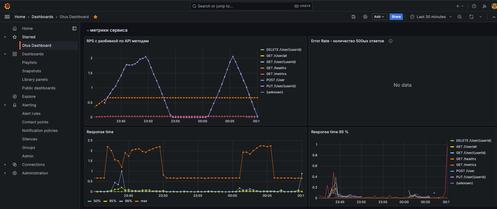

## Скачиваем репозиторий с prometheus
helm repo add prometheus-community https://prometheus-community.github.io/helm-charts
helm repo update

## Устанавливаем весь стек - прометей + оператор + графана
helm install stack prometheus-community/kube-prometheus-stack -f ./prometheus.yaml

### Подписываемся на prometheus на порт 9090
kubectl port-forward service/prometheus-operated 9090
http://arch.homework:9090/graph

### Подписываемся на grafana на порт 9090
kubectl port-forward service/stack-grafana  9000:80
http://arch.homework:9000
Логпас admin / prom-operator

### Запустим бенчмарк на один из методов сервиса
ab -n 500 -c 50 http://arch.homework/user/all

## Grafana Dashboard 
### файлик во вложении
### Скриншот
